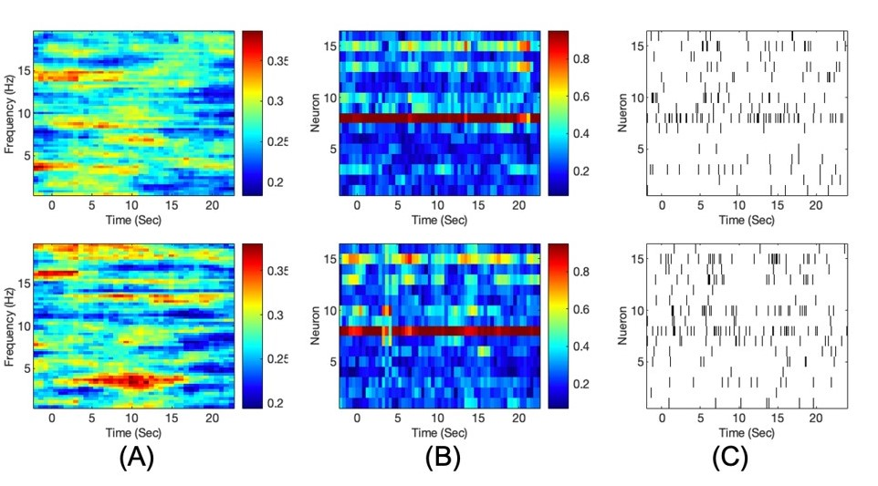

# Expriment Description
In this project, we use empirical point-process coherence and global coherence analysis to study the human Amygdala dataset.

## Data
We present an electrophysiological dataset collected from the amygdalae of nine subjects attending a visual dynamic stimulation of emotional aversive content. The subjects were patients affected by epilepsy who underwent preoperative invasive monitoring in the mesial temporal lobe. Subjects were presented with dynamic visual sequences of fearful faces (aversive condition), interleaved with sequences of neutral landscapes (neutral condition).

We provide the recordings of intracranial EEG (iEEG) and metadata related to the task, subjects, sessions and electrodes in the BIDS standard. 

Data is publicly available. Please check the [OpenNeuro Repository](https://openneuro.org/datasets/ds003374/versions/1.1.1)

## Results
Here, we try to address how the stimulus content is being encoded in the spike timings of neural populations? 
Figure 1 shows point-process coherence analysis in the human Amygdala dataset. Preliminary result shows an increased synchrony in the Theta band (~3.5 Hz), which can be seen in this figure in aversive condition. This result corroborates physiological findings in rodents, where increased BLA’s neurons synchrony was observed in Theta band in response to fear stimulus [ref](https://pubmed.ncbi.nlm.nih.gov/21738775/). 

### Figure 1 - Human amygdala data analysis

 **Point-Process Coherence Analysis in Human Amygdala Dataset. (A)** Cohereogram from 0.5 to 20 Hz in response to the neutral and aversive conditions. The stimulus starts at time 0 and lasts for 24 seconds. A clear increase in coherence can be seen from time 5 to 15 seconds in Theta band in the aversive condition, right panel. **(B)** Temporal progression of principal eigenvector. During the aversive condition, larger number of neurons are entrained to those with a regular spike timing. **(C)** Raster plot of 16 neurons in a sample trial in the neutral and aversive conditions. The increased synchrony can be easily seen in 5 to 15 seconds during the aversive condition.