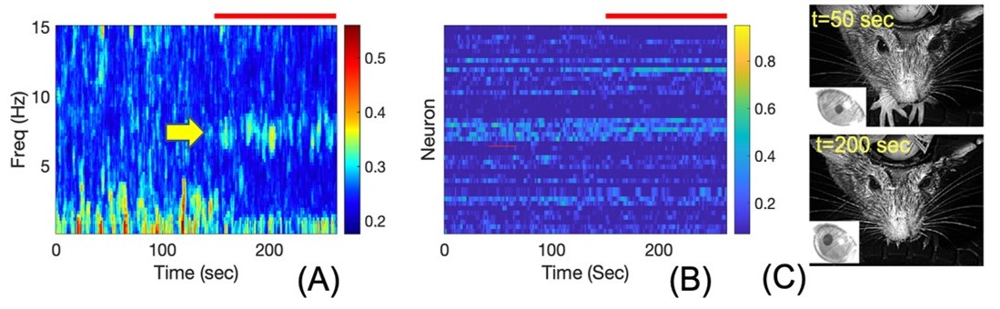

# Expriment Description
Large scale recordings of brain-wide activity in awake mice during spontaneous behavior are publicly available to allow studies on how multidimensional behaviors are represented in distributed neural data. 
Using the mice dataset, we are interested in studying how coherence analysis will reveal interactions across neural nodes and their connections to behavior. To study the data, we will use empirical and parametric point-process coherence; we will also utilize mixed-data coherence analysis to study neural and behavioral data in tandem.

## Data

 Neural recordings of more than 3000 neurons are being recorded using eight-probe Neuropixels in awake mice (n=3), covering frontal, sensorimotor, retro-splenial cortex, hippocampus, striatum, thalamus, and mid-brain. The complete description of the experiment protocol can be found in [Stringer et. al (2019)](https://www.nature.com/articles/s41586-019-1346-5). The analysis of this data revealed a multi-dimensional and brain-wide representation of the behavior. The result also shows despite behavior and neural activity contained fast-time scale fluctuations on the order of 200 msec, they are related to each other on a time scale of 1 second.
Data set is publicly available in the following link: [download data](https://figshare.com/articles/dataset/LFP_data_for_8-Neuropixels_recordings_from_Stringer_et_al_2019_Science/8784311)

## Results
 Figure 1 shows elevated synchrony in the high-theta band as the mice start moving whiskers and eye gaze direction in response to stimuli

### Figure 1 - Behavioral Analysis

**Behavioral changes accompany elevated coherence in spiking.** Description of the dataset can be found in section 3.1.2. The coherence analysis is is shown for 250 seconds of the data. The coherence analysis is done over a subsampled neuronal population with 10 percent of neurons picked based on the brain regions (~100 neurons). **A)** Elevated synchrony in high-theta band starts from 150 seconds accompanying behavior change (red bar). There is a rapid switch in neural synchrony from the delta to the high-theta band around time 150 seconds. We hypothesize that the delta band synchrony is because of breathing; whilst the high-theta will represent some cognitive function **B)** Principal eigenvector over time showing more stable pattern of multi-neuron recruitment into synchronous group after 150 seconds.  **C)** Images of mouse expression at time 50 and 200 seconds; the increased high-theta synchrony might encode elements of the behavior (eye gaze direction and increased whisking).
